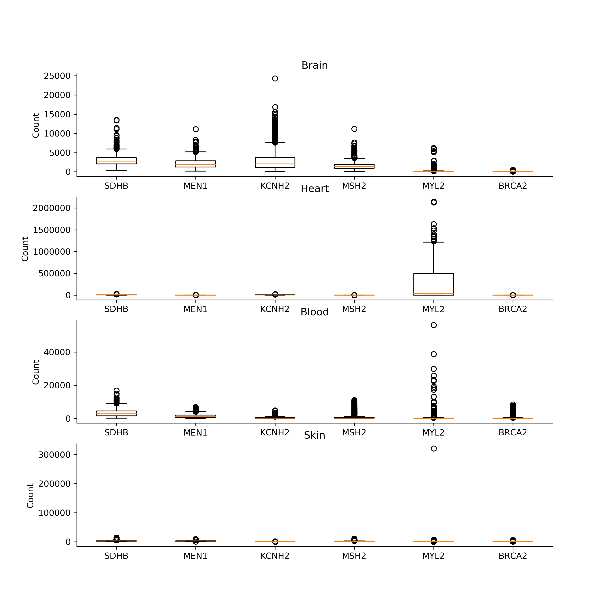
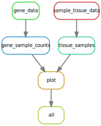
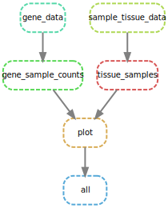
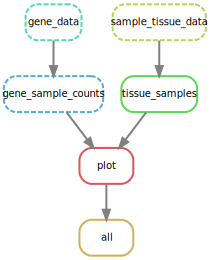
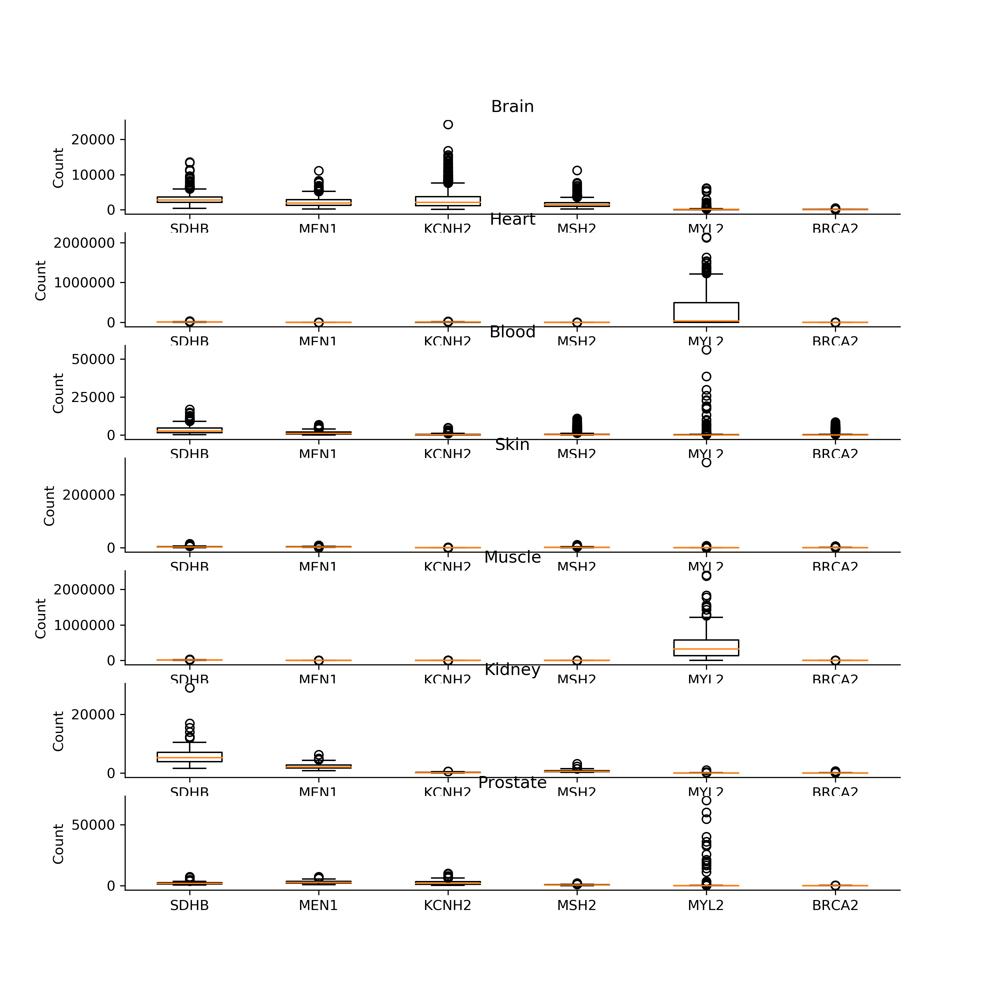

# workflow-tlfobe

[](https://travis-ci.com/cu-swe4s-fall-2019/workflow-tlfobe)

This repository is a testcase for using SnakeMake to run a pipeline of files. In this repo one can generate a series of boxplots of the gene counts for any number of genes and tissues found in the GTEx dataset.

## Installation

To install this program, make sure you have `matplotlib` installed. `matplotlib` can be installed using conda:

```
$ conda install matplotlib --yes
```

Otherwise, all other modules are python modules. This was developed and tested on Python 3.6.

## Usage

To use this pipeline, one only has to type:
```
$ snakemake
```

The full workflow results in figure like such: 


To change which genes and tissues are used to generate specific histograms, you can modify the `TISSUES` and `GENES` variables at the head of the `Snakemake` file.

```
TISSUES = ["Brain", "Heart", "Blood", "Skin" ]
GENES = ["SDHB", "MEN1", "KCNH2", "MSH2", "MYL2", "BRCA2"]
```

## Workflow

This output will run the entire pipeline, which:
1. Pulls down both `GTEx_Analysis_v8_Annotations_SampleAttributesDS.txt` and `GTEx_Analysis_2017-06-05_v8_RNASeQCv1.1.9_gene_reads.acmg_59.gct.gz`. These are both datafiles that contain the relevant data present in the output boxplots.
2. Extracts tissue datafiles, which contains sample ID numbers pertaining to specific tissue types. (`Brain.txt`, `Blood.txt`)
3. Extracts gene datafiles, which contains sample IDs and their gene counts for specific genes. (`BRCA2.txt`, `MEN1`)
4. Uses those files to generate a plot with boxplots of the gene counts for each tissue and gene type.

`snakemake` manages which programs are run using rules established in the `Snakefile` file. Using the following command we can visualize the dependencies setup from our `Snakefile`

```
snakemake --dag | dot -Tsvg -o dag.svg
```



Task is denoted as a bubble. Each bubble has a set of inputs and outputs. Using these rules, `snakemake` is able to run specific jobs in the correct order to produce the desired output. To see what `snakemake` would without actually running the program, one can run:
```
$ snakemake --dryrun
Building DAG of jobs...
Job counts:
        count   jobs
        1       all
        1       gene_data
        1       gene_sample_counts
        1       plot
        1       sample_tissue_data
        1       tissue_samples
        6

[Thu Nov 21 16:29:32 2019]
rule gene_data:
    output: GTEx_Analysis_2017-06-05_v8_RNASeQCv1.1.9_gene_reads.acmg_59.gct.gz
    jobid: 4


[Thu Nov 21 16:29:32 2019]
rule sample_tissue_data:
    output: GTEx_Analysis_v8_Annotations_SampleAttributesDS.txt
    jobid: 5


[Thu Nov 21 16:29:32 2019]
rule tissue_samples:
    input: GTEx_Analysis_v8_Annotations_SampleAttributesDS.txt
    output: Brain.txt, Heart.txt, Blood.txt, Skin.txt
    jobid: 3


[Thu Nov 21 16:29:32 2019]
rule gene_sample_counts:
    input: GTEx_Analysis_2017-06-05_v8_RNASeQCv1.1.9_gene_reads.acmg_59.gct.gz
    output: SDHB.txt, MEN1.txt, KCNH2.txt, MSH2.txt, MYL2.txt, BRCA2.txt
    jobid: 2


[Thu Nov 21 16:29:32 2019]
rule plot:
    input: SDHB.txt, MEN1.txt, KCNH2.txt, MSH2.txt, MYL2.txt, BRCA2.txt, Brain.txt, Heart.txt, Blood.txt, Skin.txt
    output: Brain-Heart-Blood-Skin_SDHB-MEN1-KCNH2-MSH2-MYL2-BRCA2.png
    jobid: 1


[Thu Nov 21 16:29:32 2019]
localrule all:
    input: Brain-Heart-Blood-Skin_SDHB-MEN1-KCNH2-MSH2-MYL2-BRCA2.png
    jobid: 0

Job counts:
        count   jobs
        1       all
        1       gene_data
        1       gene_sample_counts
        1       plot
        1       sample_tissue_data
        1       tissue_samples
        6
This was a dry-run (flag -n). The order of jobs does not reflect the order of execution.
```

Witht the dry run, we see this program will run 6 different rules. When we actually run the program, there will be much more output.

```
snakemake
```
However when we run `snakemake` we can update our DAG diagram, and we see that the previously solid lines have now turned into dashed lines, representing that this task is complete.



Depending on how the repository is setup, a variety of these dependencies may or may not be setup to run, say a number of data files are already generated or the current directory is missing a database file. `snakemake` allows a user to reduce the amount of computation needed by confirming whether jobs have been run previously. This way, if the desired plot has already been generated, `snakemake` knows to not run anything.

For example, if we wanted to generate a plot with more tissue, say add Adipose, Kidney and Muscle tissue to the mix, `snakemake` would only run the right side branch of the dependency to generate more tissue data files. Looking at the DAG tree below, we see that the `gene_sample_counts` job is already completed since we didn't add new genes, but the `tissue samples` job has new files it has to create.




If we run a dry run on this state, we see, `snakemake` will only run 3 jobs instead of the original 6.

```
$ snakemake
Building DAG of jobs...
Job counts:
        count   jobs
        1       all
        1       plot
        1       tissue_samples
        3

[Thu Nov 21 16:40:48 2019]
rule tissue_samples:
    input: GTEx_Analysis_v8_Annotations_SampleAttributesDS.txt
    output: Brain.txt, Heart.txt, Blood.txt, Skin.txt, Adipose.txt, Kidney.txt, Prostate.txt
    jobid: 3


[Thu Nov 21 16:40:48 2019]
rule plot:
    input: SDHB.txt, MEN1.txt, KCNH2.txt, MSH2.txt, MYL2.txt, BRCA2.txt, Brain.txt, Heart.txt, Blood.txt, Skin.txt, Adipose.txt, Kidney.txt, Prostate.txt
    output: Brain-Heart-Blood-Skin-Adipose-Kidney-Prostate_SDHB-MEN1-KCNH2-MSH2-MYL2-BRCA2.png
    jobid: 1


[Thu Nov 21 16:40:48 2019]
localrule all:
    input: Brain-Heart-Blood-Skin-Adipose-Kidney-Prostate_SDHB-MEN1-KCNH2-MSH2-MYL2-BRCA2.png
    jobid: 0

Job counts:
        count   jobs
        1       all
        1       plot
        1       tissue_samples
        3
This was a dry-run (flag -n). The order of jobs does not reflect the order of execution.
```

The figure generated from this run is shown below:



